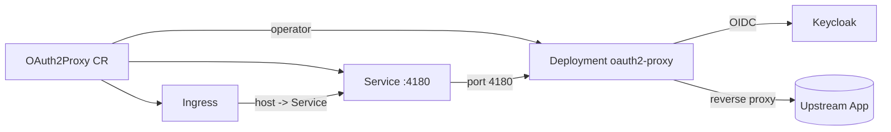

# oauth2-proxy-operator

[](https://github.com/ckyvra/oauth2-proxy-operator/actions/workflows/ci.yaml)
[](https://goreportcard.com/report/github.com/ckyvra/oauth2-proxy-operator)
[](https://github.com/ckyvra/oauth2-proxy-operator)
[](https://github.com/ckyvra/oauth2-proxy-operator/blob/main/LICENSE)
[](https://github.com/ckyvra/oauth2-proxy-operator/releases)

A Kubernetes operator that manages [oauth2-proxy](https://github.com/oauth2-proxy/oauth2-proxy) instances configured for **Keycloak** OIDC authentication.

## Architecture



The operator watches `OAuth2Proxy` custom resources and reconciles:

- A **Deployment** running oauth2-proxy, configured as an OIDC client against Keycloak
- A **Service** exposing the proxy on port 4180
- An **Ingress** (optional) routing external traffic to the proxy

## CRD

| Field | Type | Required | Description |
|---|---|---|---|
| `upstream` | string | yes | Upstream application URL to protect (e.g. `http://app:8080`) |
| `address` | string | no | oauth2-proxy listen address (default: `:4180`) |
| `clientId` | string | yes | Keycloak OIDC client ID |
| `clientSecret` | object | no | Reference to a Kubernetes Secret containing the `client-secret` key (`name`, `namespace`) |
| `realm` | string | yes | Keycloak realm name |
| `issuer` | string | yes | Full Keycloak issuer URL (e.g. `https://keycloak.example.com/realms/myrealm`) |
| `role` | string | no | Keycloak role required to access the application |
| `keycloakRole` | string | no | Alternative or more specific Keycloak role |
| `replicas` | int | no | Number of replicas (default: `1`) |
| `image` | string | no | oauth2-proxy image (default: `quay.io/oauth2-proxy/oauth2-proxy:v7.8.1`) |
| `ingress.enabled` | bool | no | Enable ingress creation |
| `ingress.host` | string | no | Hostname for the ingress rule |
| `ingress.ingressClassName` | string | no | Ingress class name (e.g. `traefik`, `nginx`) |
| `ingress.tlsSecretName` | string | no | Name of the TLS secret for HTTPS |

## Quick start

```bash
# Install the CRD
kubectl apply -f config/crd/

# Create a secret with your Keycloak client secret
kubectl apply -f config/samples/secret.yaml
# Edit the secret value first: your-keycloak-client-secret-here

# Create the OAuth2Proxy resource
kubectl apply -f config/samples/oauth2proxy_v1alpha1_oauth2proxy.yaml

# Check status
kubectl get oauth2proxies
```

## Deploy the operator

```bash
make docker-build docker-push
make deploy
```

## Example

```yaml
apiVersion: oauth2proxy.kyvrakidis.com/v1alpha1
kind: OAuth2Proxy
metadata:
  name: my-proxy
spec:
  upstream: http://my-app:8080
  clientId: my-client
  clientSecret:
    name: oauth2-proxy-secret
  realm: my-realm
  issuer: https://keycloak.example.com/realms/my-realm
  role: app-user
  replicas: 2
  ingress:
    enabled: true
    host: auth.my-app.example.com
    ingressClassName: traefik
```

The operator creates:
- A **Deployment** running oauth2-proxy with the OIDC provider pointed at your Keycloak issuer
- A **Service** exposing port 4180
- An **Ingress** (if `ingress.enabled: true`) routing traffic from the host to oauth2-proxy

## Testing

The integration tests use [envtest](https://pkg.go.dev/sigs.k8s.io/controller-runtime/pkg/envtest), which runs a real Kubernetes API server locally.

```bash
# First install envtest binaries (one time)
go install sigs.k8s.io/controller-runtime/tools/setup-envtest@latest
setup-envtest use 1.31.x

# Run tests
make test
```

## Development

```bash
make build     # build the binary
make run       # run locally (no leader election)
make test      # run integration tests
```

## License

Apache 2.0
